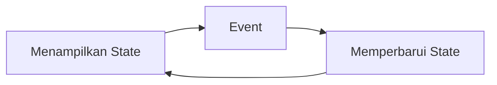
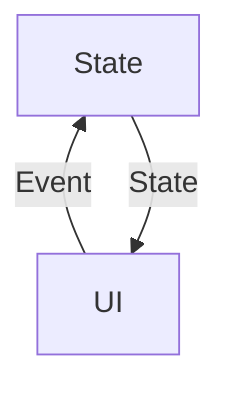

# Mengatur State pada Compose

State adalah data yang berubah-ubah sepanjang waktu untuk mengontrol UI

## Unidirectional data flow

Urutan perbaruan UI



Event: segala sesuatu yang dapat menyebabkan state berubah

Contoh untuk TextField

```kotlin
// still missing something...   (fix on next section)
@Composable
fun FormInput() {
    var name = ""                         // <<< state
    OutlinedTextField(
        value = name,                     // <<< display state
        onValueChange = { newName ->      // <<< event
            name = newName                // <<< update state
        }
    ),
    label = { Text("Name") },
    modifier = Modifier.padding(8.dp)
}
```

Inti dari mengatur state di compose adalah tentang memahami interaksi antara State dan Event. Compose menggunakan unidirectional data flow (UDF) untuk mengaturnya.

UDF: pattern yang mengalirkan Events ke atas dan State ke bawah

Intinya, aliran data (State) hanyalah searah dari parent composable ke child composable. Pada compose, data terletak di parent composable dan akan dikirim ke child composable. Ketika terjadi perubahan data, hanya parent composable yang dapat memperbarui datanya. Child hanya bisa mengirimkan event terbaru atau memberikan sinyal bila data perlu diperbarui oleh parent composable.



#### Manfaat mengikuti pattern UDF

- Testability: pengetesan lebih mudah
- State encapsulation: pengubahan state hanya bisa dilakukan di satu tempat
- UI consistency: state yang dibuat langsung direfleksikan dalam bentuk UI

## `mutableStateOf`, `remember`, dan `rememberSaveable`

Memberitahu sistem akan recomposition:

> menggunakan `mutableStateOf`dan `remember`

```kotlin
@Composable
fun FormInput() {
    val name = remember { mutableStateOf("") }  // <<< state
    OutlinedTextField(
        value = name.value,                     // <<< display state
        onValueChange = { newName ->            // <<< event
            name.value = newName                // <<< update state
        }
    ),
    label = { Text("Name") },
    modifier = Modifier.padding(8.dp)
}
```

**`mutableStateOf`** berfungsi untuk melacak state. Ia akan mengubah nilai di dalamnya menjadi MutableState yang merupakan tipe observable di compose. Compose akan selalu membaca nilai di dalamnya, sehingga ketika ada perubahan data, UI juga akan dibuat ulang.

**`remember`** berfungsi untuk menyimpan nilai tersebut ke dalam memory sehingga datanya tidak hilang ketika terjadi recomposition.

> menggunakan `by remember`

```kotlin
import androidx.compose.runtime.getValue
import androidx.compose.runtime.setValue

@Composable
fun FormInput() {
    var name by remember { mutableStateOf("") } // <<< state
    OutlinedTextField(
        value = name,                           // <<< display state
        onValueChange = { newName ->            // <<< event
            name = newName                      // <<< update state
        }
    ),
    label = { Text("Name") },
    modifier = Modifier.padding(8.dp)
}
```

**`rememberSaveable`** mirip dengan `remember`, yang membedakan Ia menyimpan state state dalam Bundle selama terjadi configuration change (mirip dengan onSaveInstanceState pada Activity)

> sebaiknya hanya digunakan untuk menyimpan data tipe primitif saja
