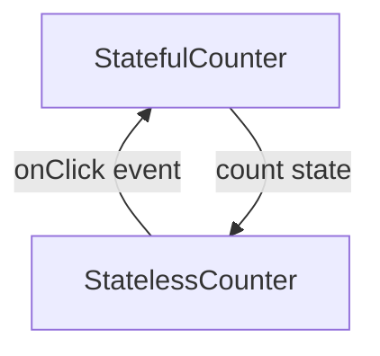

# State Hoisting pada Compose

## Stateful dan stateless

**Stateful** adalah jenis composable function yang menyimpan state di dalamnya. Jenis ini kurang reusable dan susah dites.

**Stateless** adalah jenis composable function yang tidak menyimpan state di dalamnya. Jenis ini lebih fleksibel dan mudah dites.

## State hoisting

State hoisting merupakan pattern untuk memindahkan state ke parent atasnya supaya sebuah composable menjadi stateless.

Manfaat:

- Single source of truth
- Shareable
- Interceptable
- Decoupled

### Implementasi:

##### Stateful composable function

```kotlin
@Composable
fun StatefulCounter(modifier: Modifier = Modifier) {
    Column(
        horizontalAlignment = Alignment.CenterHorizontally,
        modifier = modifier.padding(16.dp)
    ) {
        var count by rememberSaveable { mutableStateOf(0) }     // state
        Text("Button clicked $count times:")
        Button(onClick = { count++ } ) {                        // event
            Text("Click me!")
        }
    }
}
```

##### Stateless composable function

```kotlin
@Composable
fun StatefulCounter(modifier: Modifier = Modifier) {
    var count by rememberSaveable { mutableStateOf(0) }
    StatelessCounter(
        count = count,
        onClick = { count++ },
        modifier = modifier,
    )
}

@Composable
fun StatelessCounter(
    count: Int,                       // state
    onClick: () -> Unit,              // event
    modifier: Modifier = Modifier,
) {
    Column(
        horizontalAlignment = Alignment.CenterHorizontally,
        modifier = modifier.padding(16.dp)
    ) {
        Text("Button clicked $count times:")
        Button(onClick = { onClick() } ) {
            Text("Click me!")
        }
    }
}
```

Proses ini juga menjelaskan cara penerapan pattern unidirectional data flow (UDF):



### Best practice

Di mana sebaiknya state dari sebuah komponen diletakkan?

- State setidaknya diletakkan di **level parent terendah** dari semua composable yang **membaca state**
- State setidaknya diletakkan di **level parent tertinggi** dari composable yang dapat **mengubah/menulis state**
- Jika **dua state berubah ketika ada event yang sama**, mereka harus diletakkan di **level yang sama**

##### Contoh penempatan state yang salah

```kotlin
@Composable
fun MyScreen(modifier: Modifier = Modifier) {
    // State terletak di MyScreen dan MySwitch
    var checked by remember { mutableStateOf(false) }
    Row (
        verticalAlignment = Alignment.CenterVertically,
        modifier = modifier.padding(16.dp)
    ){
        MySwitch(initialChecked = checked, onCheckChanged = {checked = it})
        Text(
            text = if(checked) "ON" else "OFF",
            Modifier.clickable {
                checked = !checked
            }
        )
    }
}

@Composable
fun MySwitch(
    initialChecked: Boolean,
    onCheckChanged: (Boolean) -> Unit,
    modifier: Modifier = Modifier
) {
    // State terletak di MyScreen dan MySwitch
    var checked by remember { mutableStateOf(initialChecked) }
    Switch(
        checked = checked,
        onCheckedChange = {
            checked = it
            onCheckChanged(it)
        }
    )
}
```

##### Contoh penempatan state yang benar

```kotlin
@Composable
fun MyScreen() {
    // State hanya ada di MyScreen
    var checked by remember { mutableStateOf(false) }
    Row (
        verticalAlignment = Alignment.CenterVertically,
        modifier = Modifier.padding(16.dp)
    ){
        MySwitch(checked = checked, onCheckChanged = {checked = it})
        Text(
            text = if(checked) "ON" else "OFF",
            Modifier.clickable {
                checked = !checked
            }
        )
    }
}

// checked bersifat Immutable (tidak dapat diubah)
@Composable
fun MySwitch(checked: Boolean, onCheckChanged: (Boolean) -> Unit) {
    Switch(
        checked = checked,
        onCheckedChange = {
            onCheckChanged(it)
        }
    )
}
```

## Links

[Exercise](./MyTemperatureConverter/app/src/main/java/com/example/mytemperatureconverter/MainActivity.kt)

- https://developer.android.com/jetpack/compose/architecture
- https://www.youtube.com/watch?v=rmv2ug-wW4U
- https://www.youtube.com/watch?v=zOQrkoWnSOc
