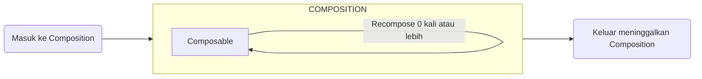
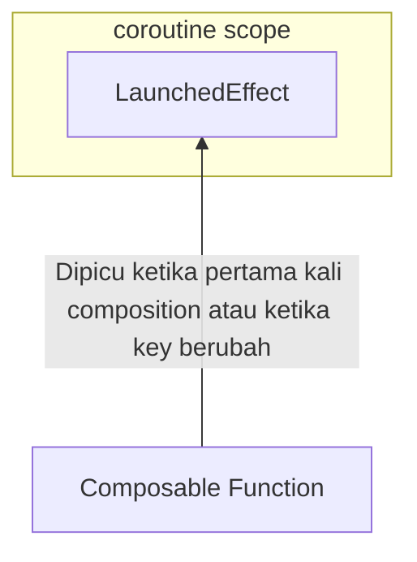
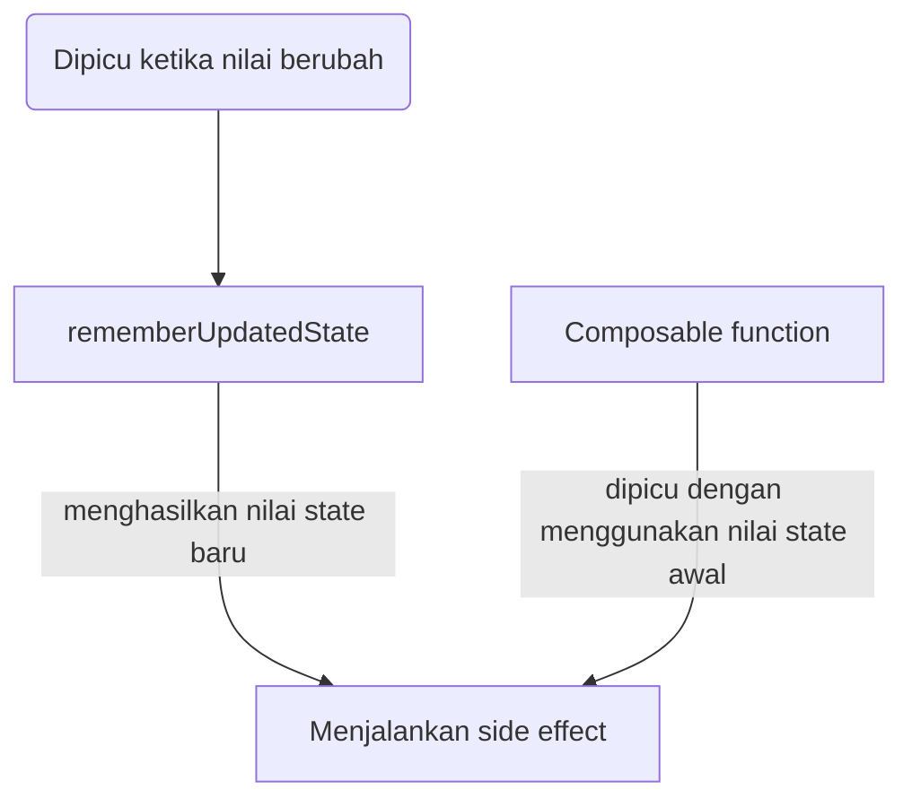
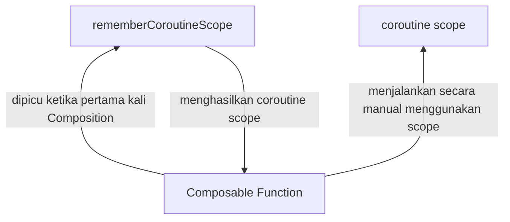
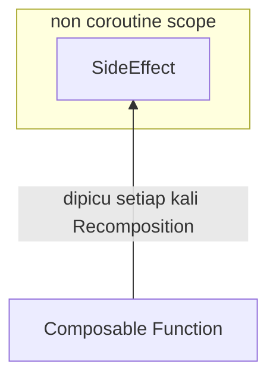
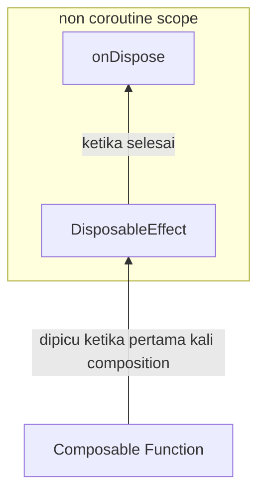
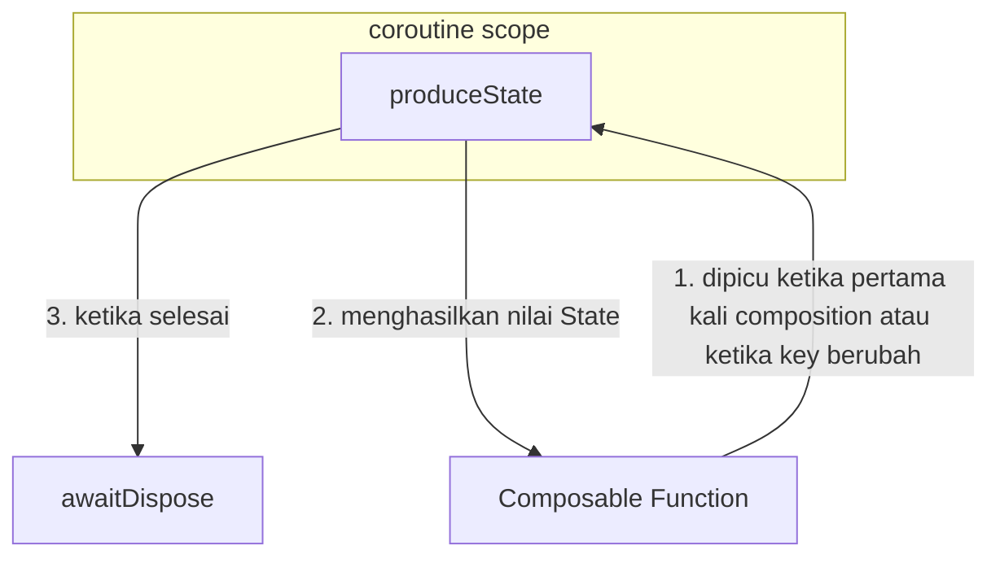
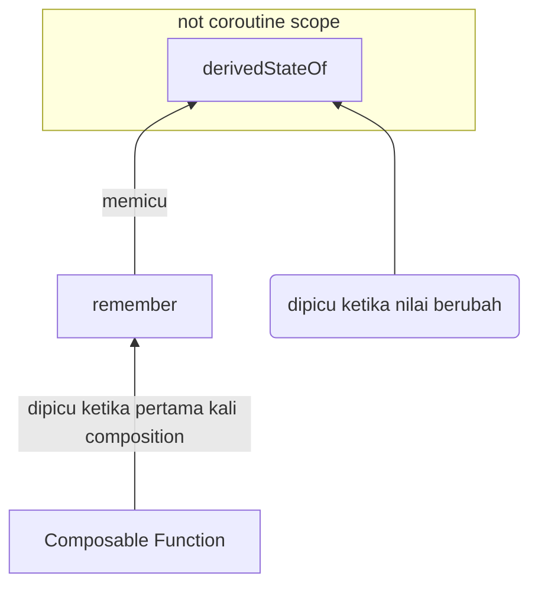
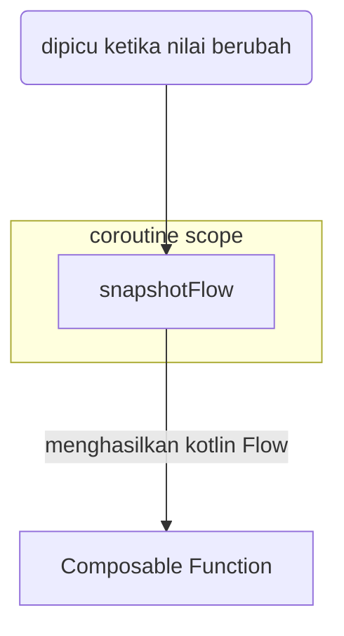

# Side Effect & Effect Handling

## Lifecycle composable

Alur Composable sangatlah simple dibandingkan dengan Activity maupun Fragment



Satu-satunya cara untuk memodifikasi Composition adalah melalui Recomposition

## Side effect

Side effect adalah segala sesuatu yang mengubah state dari luar scope Composable Function. Idealnya composable function seharusnya bebas dari side effect karena bisa menyebabkan Recomposition yang tak terprediksi dan berulang kali.

```kotlin
var i = 0
@Composable
fun MyComposable() {
    i++                         // side effect
    Log.d("Check", "$i")
    Button(onClick = {}) {
        Text(text = "Click")
    }
}
```

## Effect handler

Side effect terkadang masih dibutuhkan. Sebagai contoh adalah ketika ada one-off event seperti menampilkan Snackbar dan membuka halaman lain. lalu bagaimana cara mengontrol side effect supaya tetap aman? Gunakan Side Effect API.

Side Effect API sebagai Effect Handler. API ini berfungsi:

- Memastikan Effect berjalan pada lifecycle yang tepat
- Memastikan Effect dibersihkan ketika keluar dari Composition
- Memastikan suspend function dibatalkan ketika keluar dari Composition
- Effect yang bergantung pada input yang bervariasi secara otomatis dibersihkan dan dijalankan lagi ketika nilainya berubah

Berikut beberapa Side Effect API yang bisa dimanfaatkan:

### 1. `LaunchedEffect`

Digunakan untuk melakukan aksi tertentu yang hanya dipanggil sekali ketika initial composition atau parameter Key berubah. Juga merupakan Coroutine scope sehingga dapat memanggil suspend function di dalamnya. Ia lifecycle aware dengan lifecycle Composable sehingga proses apa pun yang dijalankan akan dibatalkan ketika keluar dari Composable function.



```kotlin
@Composable
fun MyCountdown() {
    var timer by remember { mutableStateOf(60) }
    Text("Countdown: $timer")
    LaunchedEffect(true) {      // true --> nilai key tetap. kode dipanggil sekali
        delay(1000)
        timer--
    }
}
```

### 2. `rememberUpdatedState`

Digunakan untuk menandai suatu nilai supaya tidak ter-restart walaupun key berubah.



```kotlin
@Composable
fun MyCountdownTimeout(onTimeout: () -> Unit) {
    var timer by remember { mutableStateOf(10) }
    val currentOnTimeout by rememberUpdatedState(onTimeout)
    Text("Countdown: $timer")
    LaunchedEffect(true) {
        while (timer > 0) {
            delay(1000)
            timer--
        }
        currentOnTimeout        // timeout akan dipanggil ketika waktu sudah habis
    }
}

@Composable
fun MyApp() {
    var showTimeOutScreen by remember { mutableStateOf(false) }
    if(showTimeOutScreen) {
        TimeOutScreen()
    } else {
        MyCountdownTimeout(onTimeout = {
            Log.d("MyApp", "onTimeout called")
            showTimeOutScreen = true
        })
    }
}
```

### 3. `rememberCoroutineScope`

Membuat coroutine scope untuk menjalankan suspend function di luar Composable function yang aware dengan lifecycle compose. Berbeda dengan `LaunchedEffect` yang langsung menjalankan effect, `rememberCoroutineScope` dapat diatur secara manual.



```kotlin
@Composable
fun MyRememberedCoroutineScope() {
    var timer by remember { mutableStateOf(60) }
    val scope = rememberCoroutineScope()
    var job: Job? by remember { mutableStateOf(null) }
    Column {
        Text(text = "Countdown : $timer")
        Button(onClick = {                                // trigger saat tombol diklik
            job?.cancel()
            timer = 60
            job = scope.launch {
                while (timer > 0) {
                    delay(1000)
                    timer--
                }
            }
        }){
            Text("Start")
        }
    }
}
```

Contoh penggunaan lainnya yaitu ketika mengimplementasikan drawer dan navigasi lainnya

### 4. `SideEffect`

Digunakan untuk membuat state dari kode non Compose dan akan dipanggil setiap kali recomposition berhasil



```kotlin
@Composable
fun MyCountdownSideEffect() {
    var timer by remember { mutableStateOf(60) }
    Text(text = "Countdown : $timer")
    SideEffect  {
        while (timer > 0) {                     // bukan coroutine scope
            Thread.sleep(1000)
            timer--
        }
    }
}
```

Contoh penggunaan lainnya adalah untuk memperbarui berdasarkan data dari Firebase, menentukan fokus TextField, dan mengatur system UI seperti status bar.

### 5. `DisposableEffect`

Biasanya digunakan untuk membersihkan sesuatu ketika meninggalkan composittion



```kotlin
@Composable
fun MyCountdownDisposableEffect() {
    var timer by remember { mutableStateOf(60) }
    val scope = rememberCoroutineScope()
    var job: Job? by remember { mutableStateOf(null) }
    val lifecycleOwner = LocalLifecycleOwner.current
    Column {
        Text(text = "Countdown : $timer")
        DisposableEffect(lifecycleOwner) {
            val observer = LifecycleEventObserver { _, event ->
                if (event == Lifecycle.Event.ON_START) {
                    job?.cancel()
                    timer = 60
                    job = scope.launch {
                        while (timer > 0) {
                            delay(1000)
                            timer--
                        }
                    }
                } else if (event == Lifecycle.Event.ON_STOP) {
                    job?.cancel()
                    timer = 60
                }
            }
            lifecycleOwner.lifecycle.addObserver(observer)
            onDispose {                                             // <<<
                lifecycleOwner.lifecycle.removeObserver(observer)
            }
        }
    }
}
```

Pada contoh kode di atas, kita membaca Lifecycle aplikasi menggunakan LifecycleObserver sehingga ketika berpindah ke aplikasi lain, countdown akan berhenti dan mulai dari awal. LifecycleObserver ini akan membaca terus menerus sejak didaftarkan menggunakan addObserver. Nah, untuk membersihkannya, gunakanlah removeObserver pada block onDispose.

### 6. `produceState`

Berfungsi untuk membuat non Compose State menjadi Compose State baru. Biasanya digunakan untuk mengubah data yang berasal dari repositoty menjadi sebuah UI state



```kotlin
data class ImageUiState(
    val imageData: String? = null,
    val isLoading: Boolean = false,
    val isError: Boolean = false
)

@Composable
fun ImageScreen(
    modifier: Modifier = Modifier,
    viewModel: MyViewModel = viewModel()
) {
    val uiState by produceState(initialValue = ImageUiState(isLoading = true)) {
        val image = viewModel.image
        value = if (image != null) {
            ImageUiState(imageData = image)
        } else {
            ImageUiState(isError = true)
        }
    }
}
```

Pada contoh di atas, kita mengubah data dari ViewModel menjadi 3 state, yakni ketika loading, error, dan sukses mengambil data. Anda dapat menentukan state awal menggunakan initialValue. Selain itu, ia juga memiliki awaitDispose untuk mendeteksi jika proses batal, mirip seperti onDispose pada DisposableEffect.

### 7. `derivedStateOf`

Mengubah satu atau lebih State menjadi sebuah State baru. Berbeda dengan remember, perubahan kode di dalamnya tidak akan menyebabkan Recomposition.



Salah satu penggunaannya yaitu untuk membuat tombol jump to bottom

```kotlin
val jumpToBottomButtonEnabled by remember {
    derivedStateOf {
         scrollState.firstVisibleItemIndex != 0 ||
         scrollState.firstVisibleItemScrollOffset > jumpThreshold
    }
}
```

### 8. `snapshotFlow`

Mengonversi State pada Compose menjadi Flow. Kita dapat menggunakannya di dalam Side Effect API lain, seperti LaunchedEffect



Contoh penerapan

```kotlin
@Composable
fun MySnapshotFlow() {
    Box(
        modifier = Modifier.fillMaxSize(),
        contentAlignment = Alignment.Center
    ) {
        val listState = rememberLazyListState()

        LazyColumn(state = listState) {
            items(1000) { index ->
                Text(text = "Item: $index")
            }
        }

        var showButtonSnapshot by remember { mutableStateOf(false) }

        Column(modifier = Modifier.align(Alignment.BottomCenter)) {
            AnimatedVisibility(showButtonSnapshot) {
                Button({}) {
                    Text("Jump to Top")
                }
            }
        }

        LaunchedEffect(listState) {
            snapshotFlow { listState.firstVisibleItemIndex }
                .map { index -> index > 2 }
                .distinctUntilChanged()
                .collect {
                    showButtonSnapshot = it
                }
        }
    }
}
```

## Side Effect API summary


## Links

[Exercise: Navigation drawer (side effects)](./MyNavDrawer/app/src/main/java/com/example/mynavdrawer/MyNavDrawerApp.kt)

- https://medium.com/mobile-app-development-publication/correlating-jetpack-compose-side-effects-6cb1a1d54193
- https://betterprogramming.pub/jetpack-compose-side-effects-launchedeffect-with-example-99c2f51ff463
- https://effectiveandroid.substack.com/p/jetpack-compose-effect-handlers
