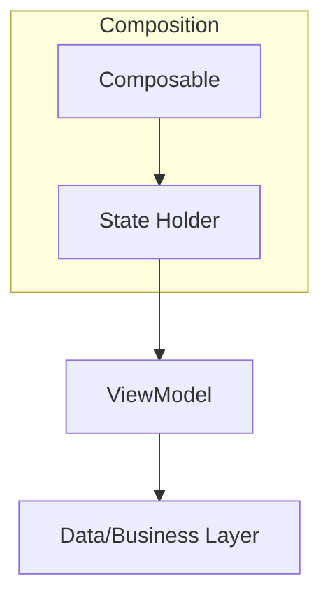

# Manajemen State dan State Holder

State bisa saja berada di tempat lain selain di Composable itu sendiri

## Tipe State dan Logic

Tipe State

- **UI element state**: hoisted state untuk elemen UI, seperti ScaffoldState.
- **Screen/UI state**: state yang dibuat untuk menentukan komponen yang tampil di halaman, seperti loading, error, atau berhasil.

Tipe logic

- **UI behavior logic atau UI logic**: logika yang berhubungan dengan tampilan UI, misalnya membuat tombol aktif atau tidak aktif, menampilkan Snackbar atau Toast. Logika ini seharusnya tetap berada di Composable.
- **Business logic**: logika yang berhubungan dengan fungsi utama aplikasi. Logika ini biasanya ada di layer data (repository).

## Macam-macam management state

- **Composable**: untuk manajemen state elemen UI yang simpel.
- **State Holder**: untuk manajemen state element UI yang kompleks. Berisi elemen UI dan UI logic.
- **Architecture Component ViewModel**: untuk dapat mengakses business logic sekaligus state UI atau Screen untuk menyiapkan data yang ditampilkan.



- Composable: UI element
- State Holder: UI element state and UI logic
- ViewModel: Akses ke business logic and screen state
- Data/Business layer: Business logic

<br />

- Composable bisa depend pada lebih dari 1 state holder atau bahkan tidak sama sekali
- State Holder bisa depend pada ViewModel jika membutuhkan data terkait business logic atau screen state
- ViewModle depend pada Data Layer

## State Holder sebagai SSoT

State Holder merupakan class biasa berisi UI element State dan UI logic yang saling berkaitan. Selain itu, di dalamnya terdapat remember supaya state tersebut tetap tersimpan walaupun terjadi Recomposition. Karena ia mengikuti lifecycle Composable, Anda dapat menggunakan Compose sebagai dependency.

State Holder bisa digunakan untuk mengatur hal yang kecil, seperti mengatur hint pada TextField, maupun hal yang besar, seperti state dari keseluruhan aplikasi.

State Holder are compoundable, alias dapat digabungkan dengan State Holder lain.

**Manfaat menggunakan State Holder**:

- Memusatkan semua perubahan State dalam satu tempat saja
- Kemungkinan untuk terjadinya out of sync menjadi sedikit
- Bisa dipakai lagi untuk komponen yang sama di tempat berbeda
- Mengurangi kompleksitas dari Composable
- Memudahkan untuk State Hoisting

Contoh penerapan

```kotlin
class FromInputState(
    initialInput: String
) {
    var input by mutableStateOf(initialInput)
}

@Composable
fun rememberFormInputState(input: String): FormInputState =
    remember(input) {
        FormInputState(input)
    }

@Composable
fun MyForm() {
    val input = rememberFormInputState("")
    FormInput(
        state = input
    )
}

@Composable
fun FormInput(
    state: FormInputState = rememberFormInputState("")
) {
    OutlinedTextField(
        value = state.input,
        onValueChange = { state.input = it },
        label = { Text("nama") },
        modifier = Modifier.padding(8.dp)
    )
}
```

## ViewModel sebagai SSoT

**Manfaat menggunakan ViewModel**

- Mempertahankan data ketika configuration change (e.g. rotasi)
- Terintegrasi dengan library Jetpack lainnya seperti Hilt dan Navigation Component
- Disimpan di cache ketika berada di Navigation backstack dan dibersihkan ketika keluar

Google merekomendasikan ViewModel untuk menyimpan state pada level halaman, bukan komponen.

```kotlin
data class ExampleUiState(
    val dataToDisplayOnScreen: List<Example> = emptyList(),
    val errorMessages: String = "",
    val loading: Boolean = false
)

class ExampleViewModel(
    private val repository: MyRepository,
    private val savedState: SavedStateHandle
) : ViewModel() {

    var uiState by mutableStateOf(ExampleUiState())
        private set

    val data: Flow<List<Data>> = repository.data

    // business logic
    fun somethingRelatedToBusinessLogic() { /* ... */ }
}

@Composable
fun ExampleScreen(
    viewModel: ExampleViewModel = viewModel()
) {
    val uiState = viewModel.uiState

    val data = viewModel.data.collectAsState
    /* ... */

    ExampleReusableComponent(
        someData = uiState.dataToDisplayOnScreen,
        onDoSomething = { viewModel.somethingRelatedToBusinessLogic() }
    )
}

@Composable
ExampleReusableComponent(
    someData: Any,
    onDoSomething: () -> Unit
) {
    /* ... */
    Button(onClick = onDoSomething) {
        Text("Do something")
    }
}
```

> Apabila data berupa stream, gunakanlah beberapa extension berikut untuk mengubahnya menjadi State
>
> - `Flow.collectAsState()`
> - `LiveData.observeAsState()` membutuhkan `androidx.compose.runtime:runtim-livedata`
> - `Observable.subscribeAsState()` membutuhkan `androidx.compose.runtime:runtime-rxjava2` atau `androidx.compose.runtime:runtime-rxjava3`

Beberapa hal yang perlu diperhatikan:

- ViewModel memiliki lifetime yang lebih panjang daripada Composeable. Untuk itu jangan letakkan state yang menahan Composition (e.g. ScaffoldState) karena bisa meyebabkan memory leak.
- Cukup gunakan ViewModel pada Composable yang di level Screen.
- Pisahkan Stateless dan Stateful Composable yang mengandung ViewModel.

## Links

[Exercise: Navigation drawer (state holder)](./MyNavDrawer/app/src/main/java/com/example/mynavdrawer/MyNavDrawerState.kt)

- https://medium.com/@takahirom/jetpack-compose-state-guideline-494d467b6e76
- https://www.youtube.com/watch?v=nVTSyLnv_4w&t=1387s
