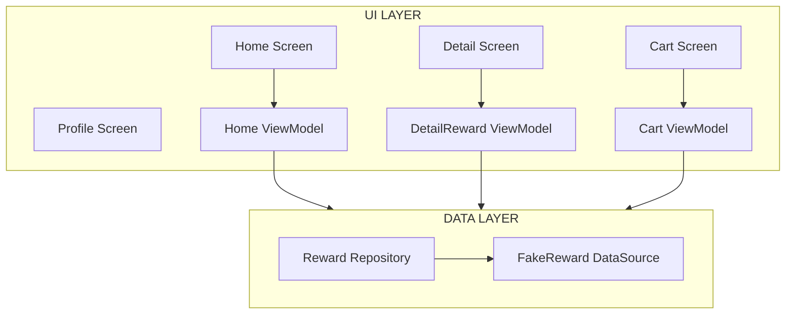
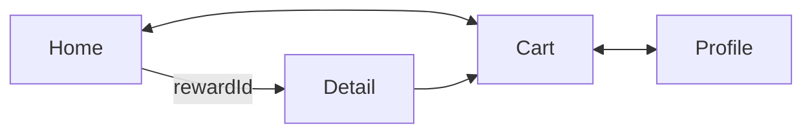
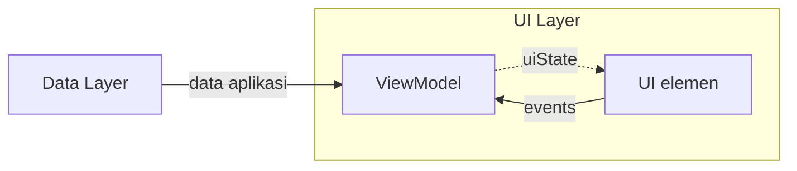

# Navigation Component

Merupakan salah satu komponen baru yang termasuk di dalam library Jetpack.

## Prinsip navigation

1. Setiap aplikasi harus memiliki start destination yang tetap.
2. Stack harus menyimpan state saat kembali lagi dari halaman selanjutnya.
3. Tombol Up dan dan tombol Back harus sesuai saat navigasi.
4. Ketika start destination, tombol Up tidak seharusnya menyebabkan keluar aplikasi. Sebaliknya Back button/gesture harus ada untuk bisa keluar aplikasi.
5. Deep Link seharusnya memiliki alur back stack yang sama dengan navigasi manual.

## Bagian-bagian navigation component untuk compose

#### 1. NavHost

Container dasar yang berfungsi sebagai host untuk menampilkan halaman yang didefinisikan. Ia akan otomatis melakukan Recomposition ketika melakukan navigasi.

#### 2. NavGraph

Memetakan alur navigasi dan halaman dalam sebuah aplikasi. Terdiri dari

- **Destination**: halaman tujuan yang bisa diakses
- **Route**: menentukan jalur yang mungkin untuk dinavigasi

#### 3. NavController

Merupakan class inti untuk melakukan eksekusi navigasi ke route yang ditentukan. Bersifat stateful dan digunakan untuk menyimpan Composable di dalam back stack.

## Back Stack

Back stack merupakan state yang menunjukkan halaman apa saja yang sedang dibuka.

Selain back secara normal, Anda juga bisa menggunakan **`popBackStack()`** untuk menghapus semua halaman yang berada di back stack dan menyisakan halaman pertama saja.

## Contoh kode

```kotlin
val navController = rememberNavController()

NavHost(
    navController = navController,
    startDestination = "first"
) {
    composable(route = "first") {
        FirstScreen()
    }
    composable(route = "second") {
        SecondScreen()
    }
}
```

Beberapa hal yang harus diperhatikan

- **rememberNavController**: digunakan untuk membuat state NavHostController (turunan dari NavController dengan fungsi tambahan supaya bisa digunakan di Composable NavHost).
- **NavHost**: digunakan untuk menghubungkan NavController dengan NavGraph.
- **composable**: merupakan extension function dari NavGraphBuilder yang berfungsi untuk menambahkan composable screen ke dalam NavGraph.

## Implementasi NavController

Setelah membuat NavController, Anda bisa bernavigasi dengan memanfaatkan

```kotlin
navController.navigate("second")
navController.navigateUp()
navController.popBackStack()
```

## Mengirim dan menerima argument

Contoh simpel

```kotlin
    composable(route = "first") {
        FirstScreen { messageContent ->
            navController.navigate("second/$messageContent")
        }
    }
    composable(
        route = "second/{content}",
    )
```

Untuk menambahkan argument pada **route** composable, Anda perlu menggunakan **slash (/)** diikuti dengan data yang dibungkus dengan **curly bracket ({})**. Kemudian untuk melakukan navigasi, cukup isikan data sesuai format pada route.

Secara default, argument dikirimkan dalam bentuk String. Jika ingin mengirimkan tipe data lainnya, Anda perlu menambahkan parameter **arguments** dengan isi berupa List NavArgument. `navArgument` digunakan untuk menentukan tipe menggunakan NavType

```kotlin
    composable(
        route = "second/{content}",
        arguments = listOf(
            navArgument("content") {
                type = NavType.StringType
            }
        )
    )
```

Beberapa format yang didukung: String, Integer, Float, Long, Boolean, Parcelable, Seriazable, Enum

Untuk mendapatkan data menggunakan **backStackEntry**

```kotlin
fun MyApp() {
    val navController = rememberNavController()
    NavHost(
        navController = navController,
        startDestination = "first"
    ) {
        composable(route = "first") {
            FirstScreen { messageContent ->
                navController.navigate("second/$messageContent")
            }
        }
        composable(
            route = "second/{content}",
            arguments = listOf(
                navArgument("content") {
                    type = NavType.StringType
                },
            )
        ) { backStackEntry ->
            SecondScreen(
                content = backStackEntry.arguments?.getString("content"),
                navigateBack = { navController.navigateUp() },
            )
        }
    }
}
```

## Multiple argument dan optional argument

Untuk menambahkan argument lain, Anda perlu menambahkan **slash (/)** lagi

```kotlin
composable(route = "first") {
    FirstScreen { messageContent ->
        navController.navigate("second/$messageContent/10")
    }
}
composable(
    route = "second/{content}/{otherContent}",
    arguments = listOf(
        navArgument("content") {
            type = NavType.StringType
        },
        navArgument("otherContent") {
            type = NavType.IntType
        },
    )
){

}
```

Untuk optional argument, gunakan **question mark (?)** beserta nama query-nya. Lalu, jika ingin menambahkan optional argument lain, gunakan tanda **ampersand (&)** sebagai pemisah.

Contoh

```uri
android-app://androidx.navigation/second/Dicoding/10?optionalContent=Welcome&otherOptionalContent=!.
```

```kotlin
composable(route = "first") {
    FirstScreen { messageContent ->
        navController.navigate("second/$messageContent/10?optionalContent=Welcome")
    }
}
composable(
    route = "second/{content}/{otherContent}?optionalContent={optionalContent}&otherOptionalContent={otherOptionalContent}",
    arguments = listOf(
        navArgument("content") {
            type = NavType.StringType
        },
        navArgument("otherContent") {
            type = NavType.IntType
        },
        navArgument("optionalContent") {
            type = NavType.StringType
            nullable = true                             // optional: menerima nullable
        },
        navArgument("otherOptionalContent") {
            type = NavType.StringType
            defaultValue = "!"                          // optional: default argument
        }
    )
)
```

## Exercise

[JetReward](./JetReward)

App structure



Navigation structure



Data flow



## Links

- https://developer.android.com/jetpack/compose/navigation
- https://developer.android.com/reference/kotlin/androidx/navigation/compose/package-summary
- https://developer.android.com/guide/navigation/navigation-principles

<br />

- https://developer.android.com/topic/architecture/ui-layer
- https://material.io/design/navigation/understanding-navigation.html
- https://youtu.be/dYTfYGwINlo
