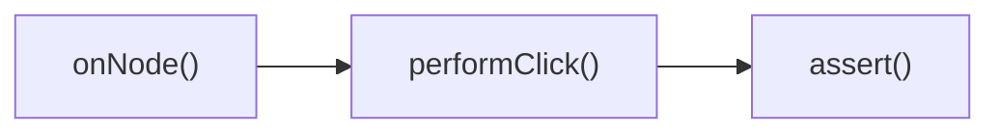

# UI Testing

UI testing pada Jetpack Compose

## Tipe UI testing

- Screen UI Test: menguji interaksi penting dalam sebuah halaman tunggal
- User Flow Test atau Navigation Test: menguji alur navigasi antara halaman

## Testing yang bagus

- Mencakup banyak skenario
  - kondisi yang sesuai (happy path)
  - kondisi yang tidak sesuai (sad path?)
  - masukan yang tidak valid
  - kondisi dari luar yang tidak diinginkan (edge case)
- Konsisten
- Fokus
- Menguji perilaku
- Cepat
- Concise

## Compose rule

Sebelum menggunakan Compose Testing API, Anda perlu memahami 2 opsi method untuk membuat Compose Rule

- **createComposeRule**: membuat rule khusus untuk Composable Function, yakni **ComposeContentTestRule**
- **createComposeAndroidRule**: membuat rule yang bisa mengakses ke Activity, yakni **AndroidComposeTestRule**

**ComposeContentTestRule** memungkinkan Anda untuk menjalankan composable apapun tanpa bantuan framework Android.

Dependency

```groovy
    // Test rules
    androidTestImplementation("androidx.compose.ui:ui-test-junit4:$compose_version")
    // Dibutuhkan untuk createComposeRule, tetapi tidak untuk createAndroidComposeRule:
    debugImplementation("androidx.compose.ui:ui-test-manifest:$compose_version")
```

## Compose Testing API

> cheatsheet: https://developer.android.com/jetpack/compose/testing-cheatsheet

- **Finder**: menemukan elemen (node) atau elemen UI yang akan diberikan aksi atau diuji

  - `onNodeWithText`
  - `onNoteWithContentDescription`
  - `onNodeWithTag`
  - `onNode(<Matcher>)`

- **Action**: memberikan event untuk melakukan sebuah aksi, seperti klik dan input teks

  - `performTextInput`
  - `performClick`
  - `performScrollToIndex`

- **Assertion**: melakukan pemeriksaan terhadap sebuah kondisi atau state dari UI yang diuji

  - `assertIs[Not]Displayed`
  - `assert[DoesNot]Exists`
  - `assertHas[No]ClickAction`
  - `assertIs[Not]Enabled`
  - `assertEquals`
  - `assert(<Matcher>)`

> `Matcher`: fungis untuk mencocokkan sesuatu
>
> - `hasText`
> - `hasContentDescription`
> - `hasTestTag`
> - `isSelected`
> - `isFocusable`
> - `hasParent`

something like



```kotlin
class MyComposeTest {
    @get:Rule
    val composeTestRule = createComposeRule()

    @Before
    fun setUp() {
        composeTestRule.setContent {
            MyAppTheme {
                MainScreen(uiState = fakeUiState, /* ... */)
            }
        }
    }

    @Test
    fun myTest() {
        composeTestRule.onNodeWithText("Continue").performClick()
        composeTestRule.onNodeWithText("Welcome").assertIsDisplayed()
    }
}
```

## Links

[Exercise: simple UI test](./MyComposeTesting/app/src/androidTest/java/com/example/mycomposetesting/ui/CalculatorAppTest.kt)
